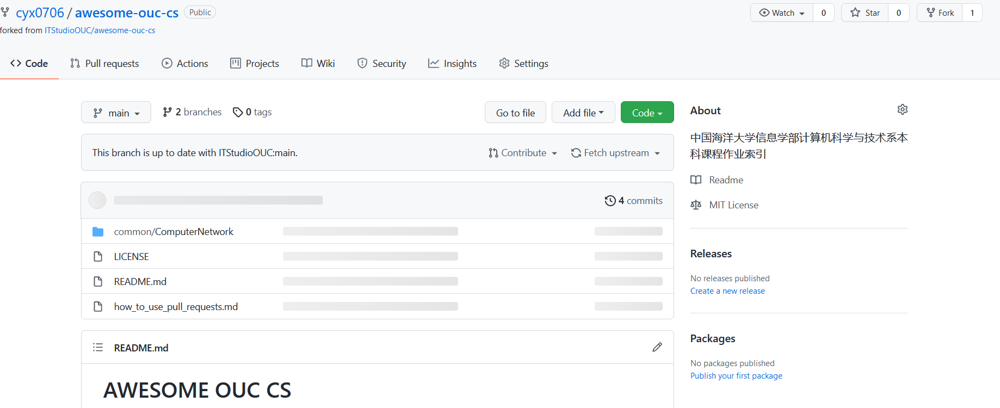
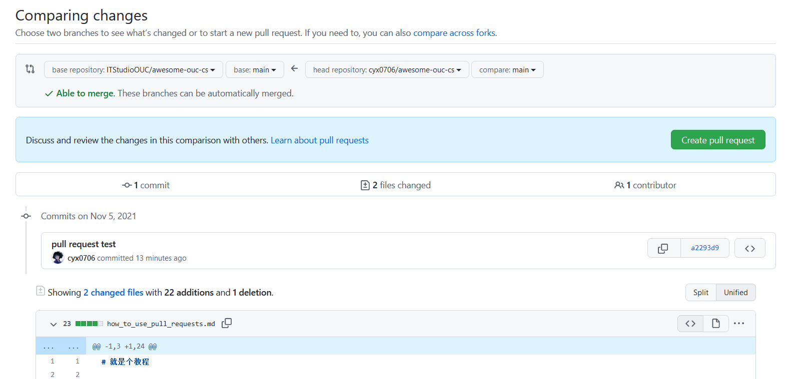

# 就是个教程

不会的看一下，会的忽略就完事了。

首先将该仓库 `fork` 到自己的仓库




然后在你的仓库中修改该分支

`git clone https://github.com/your_user_name/awesome-ouc-cs.git`

按照 project 的格式加入自己开源项目的索引后提交

```
git add *
git commit -m "some useful message"
git push
```

在 `Pull requests` 的页面发起 PR

 

提交后就可以在主项目的 `Pull requests` 里看到自己发起的 PR，之后等待仓库所有者合并即可。